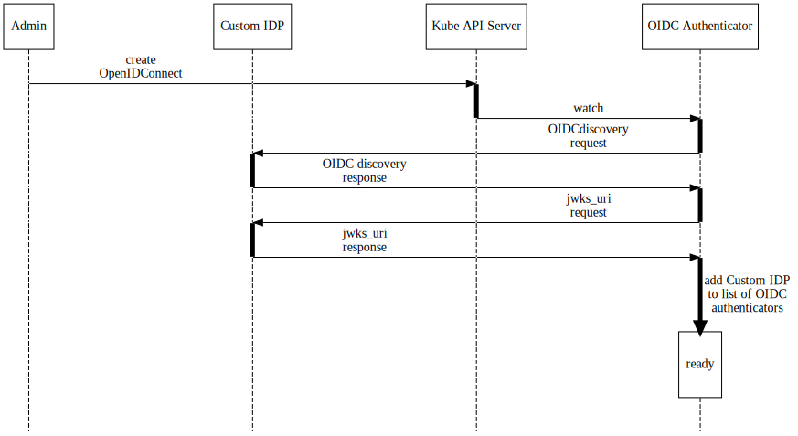
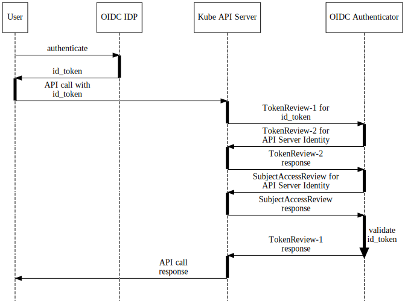

# OpenID Connect Webhook Authenticator for Kubernetes

[](https://reuse.software/)

## Table of content

- [OpenID Connect Webhook Authenticator for Kubernetes](#openid-connect-webhook-authenticator-for-kubernetes)
  - [Table of content](#table-of-content)
  - [Overview](#overview)
  - [Background](#background)
  - [Use cases](#use-cases)
  - [How it works](#how-it-works)
    - [Registration of a new OpenID Connect provider](#registration-of-a-new-openid-connect-provider)
    - [End-user authentication via new OpenIDConnect IDP](#end-user-authentication-via-new-openidconnect-idp)
  - [Docker images](#docker-images)
  - [Local development](#local-development)

## Overview

The OpenID Connect Webhook Authenticator allows Kubernetes cluster administrators to dynamically register new OpenID Connect providers in their clusters to use for kube-apiserver authentication.

> Note: This repository still in `alpha` stage and in active development. It should not be used in production. The API can change without any backwards compatibility.

## Background

In Kubernetes, only a single OpenID Connect authenticator can be used for end-users to authenticate.

To workaround this limitations, a [Webhook Token Authentication](https://kubernetes.io/docs/reference/access-authn-authz/authentication/#webhook-token-authentication) can be configured. The Kube APIServer then sends the [Bearer Tokens (id_token)](https://tools.ietf.org/html/rfc6750#section-2.1) to an external webhook for validation:

```json
{
  "apiVersion": "authentication.k8s.io/v1beta1",
  "kind": "TokenReview",
  "spec": {
    "token": "(BEARERTOKEN)"
  }
}
```

Where upon verification, the remote webhook returns the identity of the user (if authentication succeeds):

```json
{
  "apiVersion": "authentication.k8s.io/v1beta1",
  "kind": "TokenReview",
  "status": {
    "authenticated": true,
    "user": {
      "username": "janedoe@example.com",
      "uid": "42",
      "groups": [
        "developers",
        "qa"
      ],
      "extra": {
        "extrafield1": [
          "extravalue1",
          "extravalue2"
        ]
      }
    }
  }
}
```

This repository is the out-of tree implementation of [Dynamic Authentication KEP](https://github.com/kubernetes/enhancements/pull/1689).

## Use cases

- Establish trust relationship between different Kubernetes clusters using [Service Account Token Volume Projection](https://kubernetes.io/docs/tasks/configure-pod-container/configure-service-account/#service-account-token-volume-projection) and [Service Account Issuer Discovery](https://kubernetes.io/docs/tasks/configure-pod-container/configure-service-account/#service-account-issuer-discovery).
- Offer cluster admins the option to dynamically allow users from other OIDC IDPs to authenticate against their `kube-apiserver`.

## How it works

This webhook is a Kubernetes controller that acts on `OpenIDConnect` resources e.g:

```yaml
apiVersion: authentication.gardener.cloud/v1alpha1
kind: OpenIDConnect
metadata:
  name: foo
spec:
  issuerURL: https://foo.bar
  clientID: some-client-id
  usernameClaim: email
  usernamePrefix: "test-"
  groupsClaim: groups
  groupsPrefix: "baz-"
  supportedSigningAlgs:
  - RS256
  requiredClaims:
    baz: bar
  caBundle: LS0tLS1CRUdJTiBDRVJU...base64-encoded CA certs for issuerURL.
```

> Note: The fields in the specification corresponds to the [kube-apiserver OIDC flags](https://kubernetes.io/docs/reference/access-authn-authz/authentication/#configuring-the-api-server).

### Registration of a new OpenID Connect provider

The flow is following:

1. Admin adds a new `OpenIDConnect` to the cluster.
1. The webhook controller watches for changes on this resource and does [OIDC discovery](https://openid.net/specs/openid-connect-discovery-1_0.html). The [OIDC provider's  configuration](https://openid.net/specs/openid-connect-discovery-1_0.html#ProviderConfigurationResponse) has to be accessible under the `spec.issuerURL` with a [well-known path (.well-known/openid-configuration)](https://openid.net/specs/openid-connect-discovery-1_0.html#ProviderConfig).
1. The webhook controller uses the `jwks_uri` obtained from the OIDC providers configuration, to fetch the OIDC provider's public keys from that endpoint.
1. The webhook controller uses those keys, issuer, client_id and other settings to add OIDC authenticator to a in-memory list of [Token Authenticators](https://pkg.go.dev/k8s.io/apiserver/pkg/authentication/authenticator?tab=doc#Token).

An overview of the controller:



### End-user authentication via new OpenIDConnect IDP

When a user wants to authenticate to the `kube-apiserver` via this new Custom OpenIDConnect IDP:

1. The user authenticates in Custom IDP.
1. `id_token` is obtained from Custom IDP (e.g. `ddeewfwef...`).
1. The user uses `id_token` to perform an API call to Kube APIServer.
1. As the `id_token` is not matched by any build-in or configured authenticators in the Kube APIServer, it is send to OpenID Connect Webhook Authenticator for validation.

    ```json
    {
      "TokenReview": {
        "kind": "TokenReview",
        "apiVersion": "authentication.k8s.io/v1",
        "spec": {
          "token": "ddeewfwef..."
        }
      }
    }
    ```

1. The webhook uses `TokenReview` to authenticate the calling API server (the Kube APIServer for delegation of authentication and authorization might be different from the calling API server).

    ```json
    {
      "TokenReview": {
        "kind": "TokenReview",
        "apiVersion": "authentication.k8s.io/v1beta1",
        "spec": {
          "token": "api-server-token..."
        }
      }
    }
    ```

1. After the Authentication API server returns the identity of callee API server. In this case the API server is running as a Pod in a Kubernetes cluster:

    ```json
    {
        "apiVersion": "authentication.k8s.io/v1",
        "kind": "TokenReview",
        "metadata": {
            "creationTimestamp": null
        },
        "spec": {
            "token": "eyJhbGciOiJSUzI1NiIsImtpZCI6InJocEdLTXZlYjV1OE5heD..."
        },
        "status": {
            "authenticated": true,
            "user": {
                "groups": [
                    "system:serviceaccounts",
                    "system:serviceaccounts:some-namespace",
                    "system:authenticated"
                ],
                "uid": "14db103e-88bb-4fb3-8efd-ca9bec91c7bf",
                "username": "system:serviceaccount:some-namespace:kube-apiserver"
            }
        }
    }
    ```

1. The webhook makes a `SubjectAccessReview` call to the Authorization API server to ensure that callee API server is allowed to validate tokens:

    ```json
    {
      "apiVersion": "authorization.k8s.io/v1",
      "kind": "SubjectAccessReview",
      "spec": {
        "groups": [
          "system:serviceaccounts",
          "system:serviceaccounts:some-namespace",
          "system:authenticated"
        ],
        "nonResourceAttributes": {
          "path": "/validate-token",
          "verb": "post"
        },
        "user": "system:serviceaccount:some-namespace:kube-apiserver"
      },
      "status": {
        "allowed": true,
        "reason": "RBAC: allowed by RoleBinding \"kube-apiserver\" of ClusterRole \"kube-apiserver\" to ServiceAccount \"system:serviceaccount:some-namespace:kube-apiserver\""
      }
    }
    ```

1. The webhook then iterates over all registered `OpenIDConnect` Token authenticators and tries to validate the token.
1. Upon a successful validation it returns the `TokeReview` with user, groups and extra parameters:

    ```json
    {
      "TokenReview": {
        "kind": "TokenReview",
        "apiVersion": "authentication.k8s.io/v1",
        "spec": {
          "token": "ddeewfwef..."
        },
        "status": {
          "authenticated": true,
          "user": {
            "username": "test-admin@example.com",
            "groups": [
              "test-some-group"
            ],
            "extra": {
              "gardener.cloud/apiserver/groups": [
                "system:serviceaccounts",
                "system:serviceaccounts:garden",
                "system:authenticated"
              ],
              "gardener.cloud/apiserver/uid": [
                "system:serviceaccount:garden:default"
              ],
              "gardener.cloud/apiserver/username": [
                "system:serviceaccount:garden:default"
              ],
              "gardener.cloud/authenticator/name": [
                "gardener"
              ],
              "gardener.cloud/authenticator/uid": [
                "e5062528-e5a4-4b97-ad83-614d015b0979"
              ]
            }
          }
        }
      }
    }
    ```

It adds the following extra information, that can be used by custom authorizers later on:

- `gardener.cloud/apiserver/groups` contains all the groups of the API server which is making the `TokenReview` request (it's the ServiceAccount of the API Server Pod in this case).
- `gardener.cloud/apiserver/uid` contains the UID of the API server which is making the `TokenReview` request (it's the ServiceAccount of the API Server Pod in this case).
- `gardener.cloud/apiserver/username` contains the username of the API server which is making the `TokenReview` request (it's the ServiceAccount of the API Server Pod in this case).
- `gardener.cloud/authenticator/name` contains the name of the `OpenIDConnect` authenticator which was used.
- `gardener.cloud/authenticator/uid` contains the UID of the `OpenIDConnect` authenticator which was used.

An overview of the flow:



## Docker images

Pre-release docker image is available at

```text
eu.gcr.io/gardener-project/gardener/oidc-webhook-authenticator:v0.1.0-dev-a3ed1a78ba53d56b1f8dd24d0bdf540d1c9246a0
```

## Local development

For this setup several components are needed:

- [minikube](https://minikube.sigs.k8s.io/docs/start/)
- [kubelogin](https://github.com/int128/kubelogin)

The API server is started with `--authentication-token-webhook-config-file` with `kubeconfig` file pointing to the Webhook.

```shell
mkdir -p ~/.minikube/files/var/lib/minikube/certs
cp config/samples/minikube-webhook-kubeconfig.yaml ~/.minikube/files/var/lib/minikube/certs/minikube-webhook-kubeconfig.yaml

minikube start \
  --extra-config=apiserver.service-account-api-audiences=api \
  --extra-config=apiserver.authentication-token-webhook-config-file=/var/lib/minikube/certs/minikube-webhook-kubeconfig.yaml \
  --extra-config=apiserver.authentication-token-webhook-cache-ttl=10s
```

To allow easy authentication via [kubelogin](https://github.com/int128/kubelogin) the minikube IP is added as `control-plane.minikube.internal` in `/etc/hosts`

```shell
sudo sed -ie '/control-plane.minikube.internal/d' /etc/hosts
sudo echo "$(minikube ip) control-plane.minikube.internal" >> /etc/hosts
```

Add the CRD:

```shell
kubectl apply -f config/crd/bases/authentication.gardener.cloud_openidconnects.yaml
```

Build the image, so it's accessible by `minikube`:

```shell
eval $(minikube docker-env)
make docker-build
```

Deploy Dex and the oidc webhook authenticator:

```shell
kubectl apply -f config/samples/deployment.yaml
```

Add an additional user with Dex authentication to the kubeconfig and use it as current context

```shell
kubectl config set-credentials minikube-dex \
--exec-command=kubectl \
--exec-arg=oidc-login \
--exec-arg=get-token \
--exec-arg=--certificate-authority=$(readlink -f cfssl/ca.crt) \
--exec-arg=--oidc-issuer-url=https://control-plane.minikube.internal:31133 \
--exec-arg=--oidc-client-id=oidc-webhook \
--exec-arg=--oidc-client-secret=ZXhhbXBsZS1hcHAtc2VjcmV0 \
--exec-arg=--oidc-extra-scope=email \
--exec-arg=--oidc-extra-scope=profile \
--exec-arg=--oidc-extra-scope=groups \
--exec-arg=--grant-type=auto \
--exec-api-version=client.authentication.k8s.io/v1beta1

kubectl config set-context minikube-dex --user=minikube-dex --cluster=minikube
kubectl config use-context minikube-dex
```

Try to authenticate - when a browser pops up, use `admin@example.com` / `password` as email and password:

```shell
kubectl get pods
error: You must be logged in to the server (Unauthorized)
```

The authentication to the apiserver fails. Now apply the `OpenIDConneect` resource:

```shell
kubectl --context=minikube apply -f config/samples/authentication_v1alpha1_openidconnect.yaml
```

Wait a bit (the kube-apiserver caches the authentication response for `10s`) and try to execute `kubectl` commands again:

```shell
kubectl get pods
Error from server (Forbidden): pods is forbidden: User "test-admin@example.com" cannot list resource "pods" in API group "" in the namespace "default"
```

You have successfully authenticated (you can add some RBAC rules to allow that user to perform some operations).
